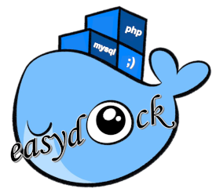

# EasyDock for Linux ;)



A fork of EasyDock to work in Linux. Dockerize your PHP apps ;)

Docker LEMP easy integration


## Features

Easydock comes with:

- nginx
- PHP (PHP-FPM 5.x, 7.x and 8.x)
- MySql (latest version of mariadb)
- Redis
- phpmyadmin
- MailHog
- node.js
- npm
- Git
- Composer

## Requirements

Docker and Docker Compose on Linux Distro

## Installation

- Integrate easydock in your PHP app via Composer

```bash
cd /path/to/your-php-application
composer require joglomedia/easydock-linux
sh ./vendor/joglomedia/easydock-linux/src/.easydock export
```

- Configure your application path into `.env.easydock` file

## Getting started

- After installation, if you need, configure your `.env.easydock` file and run:

```bash
bash easydock setup
```

- Config your app DB connection (default)

```bash
user: root
pass: secret
db: dockerdb
host: mysql ( or redis for Redis )
```

- Config your app SMTP conn (default - no user or pass are required)

```bash
host: mailhog
port: 1025
```

- Nginx config will expose your project `/public` folder

- To start your Docker istance:

```bash
bash easydock up
```

- To "SSH" into your Docker istance:

```bash
bash easydock shell
```

- To stop your Docker istance:

```bash
bash easydock down
```

- You can get application info using:

```bash
bash easydock info
```

- You can reset your Docker istance running:

```bash
bash easydock reset
```

- Everytime you change PHP version into `.env.easydock` file you have to run:

```bash
bash easydock reset
bash easydock setup
```

_*NB: Database data will be removed*_

## Security Vulnerabilities and Bugs

If you discover any security vulnerability or any bug within easydock, please open an issue.

## Contributing

Thank you for considering contributing to this project!

## Licence

Easydock is open-source software licensed under the MIT license.

### Enjoy easydock ;)
